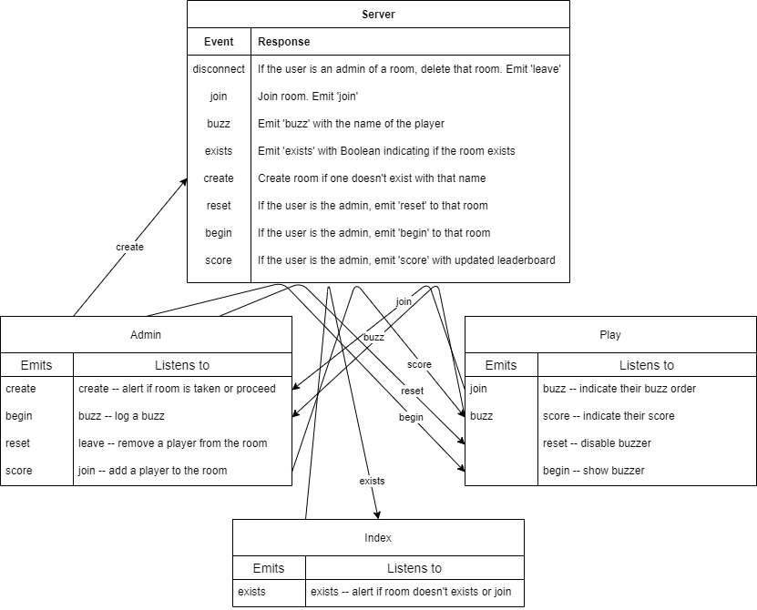

# Part 0: Overview, Environment, and Directory Structure

The goal is to create a trivia game that allows for the creation of rooms, real-time buzzing, scoring, and skipping questions. Each room will have an administrator and multiple players. The admin of the room will be able to share a link for players to join, read questions and allow buzzing once they are finished reading their question. Players will be able to buzz, see their score, and the order in which they buzzed. The admin can then judge the accuracy of the players' answers and have the leaderboard be adjusted accordingly.

## How

- [Flask](https://flask.palletsprojects.com/en/1.1.x/), a python web microframework
- [Flask-SocketIO](https://flask-socketio.readthedocs.io/en/latest/) is a Flask library for integrating with SocketIO

## Why

...Flask?
- python is an easy language to write a simple our simple API
- python also has a lot of data science libraries which would allow you to extend the game with analytics in the future
- It uses [Jinja](https://jinja.palletsprojects.com/en/2.11.x/), a simple templating engine. This allows you to write the boilerplate HTML for your site without copying and pasting it for each page.

...SocketIO?
- allows real-time bi-directional communication between the client and server
- includes functionality for rooms

## Environment

We'll use python's `venv` package to ensure everyone is using the same versions of the python packages. This is to prevent pesky incompatibility issues.

```
python -m venv env # create a virtual environment named env
source env/bin/activate # activate it (run 'deactivate' to deactivate)
pip install -r src/requirements.txt # generated by running pip freeze > requirements.txt after a successful install
```

Note: make sure to create a file called `.gitignore` and write `env/` in it. This ensures that when you make commits and put the project on GitHub, the large and unnecessary (people looking at the repo can create their own virtual environment themselves) `env` folder will not clutter the repo.

## Directory Structure

Here's a typical directory structure for a small (<1000 line) Flask app:

```
root/
+--static/ # static client-side JavaScript and CSS files
|  +--index.js
|  +--style.css
+--templates/ # HTML files with Jinja templating
|  +--index.html
+--app.py # server-side code
```

Here's how this specific project will be structured:

```
root/
+--static/
|  +--admin.js
|  +--favicon.ico # icon in the browser
|  +--index.js
|  +--play.js
|  +--style.css
+--templates/
|  +--admin.html
|  +--index.html
|  +--layout.html
|  +--play.html
+--app.py
```

# Diagram

