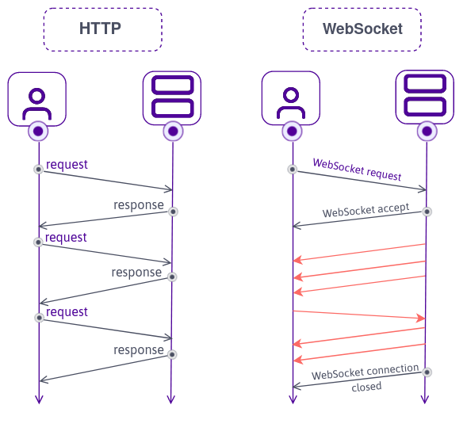

# Part 0: Overview, Environment, and Directory Structure

> See the [slides](slides/part-0.pdf) for this workshop!

The goal is to create a trivia game that allows for the creation of rooms, real-time buzzing, scoring, and skipping questions. Each room will have an administrator and multiple players. The admin of the room will be able to share a link for players to join, read questions and allow buzzing once they are finished reading their question. Players will be able to buzz, see their score, and the order in which they buzzed. The admin can then judge the accuracy of the players' answers and have the leaderboard be adjusted accordingly. To see the end result in action, see [play here](https://z.umn.edu/ADCgame).

## How

- [Flask](https://flask.palletsprojects.com/en/1.1.x/), a python web microframework
- [Flask-SocketIO](https://flask-socketio.readthedocs.io/en/latest/) is a Flask library for integrating with SocketIO

## Why

...Flask?
- python is an easy language to write, in general
- python also has a lot of data science libraries which would allow you to extend the game with analytics in the future
- It uses [Jinja](https://jinja.palletsprojects.com/en/2.11.x/), a simple templating engine. This allows you to write the boilerplate HTML for your site without copying and pasting it for each page.

...SocketIO?
- allows real-time bi-directional communication between the client and server
- includes functionality for rooms

## Environment

We first need to install python. See [this guide](https://www.tutorialdocs.com/tutorial/python3/setup-guide.html) and follow the steps for your operating system.

We'll use python's `venv` package to ensure everyone is using the same versions of the python packages. This is to prevent pesky incompatibility issues.

```
python -m venv env # create a virtual environment named env
source env/bin/activate # activate it (run 'deactivate' to deactivate)
# for windows, use env\Scripts\activate.bat
pip install -r src/requirements.txt # generated by running pip freeze > requirements.txt after a successful install
```

Note: make sure to create a file called `.gitignore` and write `env/` in it. This ensures that when you make commits and put the project on GitHub, the large and unnecessary (people looking at the repo can create their own virtual environment themselves) `env` folder will not clutter the repo.

## The big picture


The code for the application will run on two locations: the client and the server. A server is a computer tasked with responding to requests from clients. Clients are devices like laptops, smartphones, and desktops which access our application over the internet.

### Client side

Clients will request HTML, CSS, and JavaScript from the server needed to display a web page when they visit its corresponding URL.


HTML (hypertext markup language) consists of tags within angle brackets `<>` and their attributes `<div class="container">`. When nested together, they form the 'skeleton' of the web page.

CSS (cascading style sheets) define the color, font, spacing, and location of HTML tags. They are the 'skin' of a web page.

JavaScript is a programming language. It is unique because it runs on the client in their web browser. We will use it to define the logic of how the web page should be displayed depending on the clicking of buttons, submission of forms, and other events. JavaScript can be thought to be the nervous system of the web page.

### Server side

The server will run python code. Anything the client's web browser should not handle will be handled by the server. In this project, this includes the management of game rooms as well as serving the HTML, CSS, and JavaScript for the client's browser to download. This is done using the Flask python web framework. 

Also, the server is responsible for broadcasting event signals like buzzing and score changes to every client in the same room. This is done using the SocketIO integration with Flask.

### Websockets

Websockets power SocketIO.



Serving the HTML, CSS, and JavaScript for a web page is done over HTTP (hypertext transfer protocol) requests. However, this model doesn't work for more complicated communication between the client and the server. Let's say we want to broadcast to everyone in a game room that player A has scored 100 points. Then a model where the server can keep track of players in the same room and each player waits for events emitted from the server is incredibly useful. This is what websockets does. 

A two-way communication channel is opened between each client and server. This creates a powerful real-time and event-driven interface of communication.

## Directory Structure

Here's a typical directory structure for a small (<1000 line) Flask app:

```
root/
+--static/ # static client-side JavaScript and CSS files
|  +--index.js
|  +--style.css
+--templates/ # HTML files with Jinja templating
|  +--index.html
+--app.py # server-side code
```

Here's how this specific project will be structured:

```
root/
+--static/
|  +--admin.js
|  +--favicon.ico # icon in the browser
|  +--index.js
|  +--play.js
|  +--style.css
+--templates/
|  +--admin.html
|  +--index.html
|  +--layout.html
|  +--play.html
+--app.py
```

# Diagram


